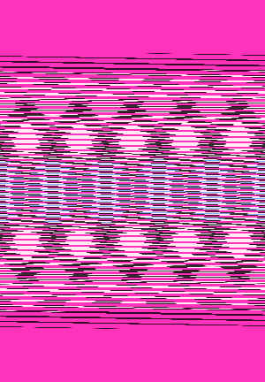

# Pixel-flow

A simple [Processing](https://processing.org/ "Processing") program to generate a new image making the pixels of a selected one to flow.

From:

To:

In order to use it:

1. [download Processing](https://processing.org/download/ "Download Processing")
1. open *pixel_flow.pde* with Processing and run it
1. select the image you would like to make its pixels flowing
1. hit <kbd>UP ARROW</kbd> to increase the width of the image by one, <kbd>DOWN ARROW</kbd> to decrease it by one, <kbd>RIGHT ARROW</kbd> to increase it by ten, <kbd>LEFT ARROW</kbd> to decrease it by ten
1. hit <kbd>ENTER</kbd> to save the new image as a .png
1. repeat step 4. and 5. to generate and save as many new images as you would like (new images are named incrementally in the context of a single session)

